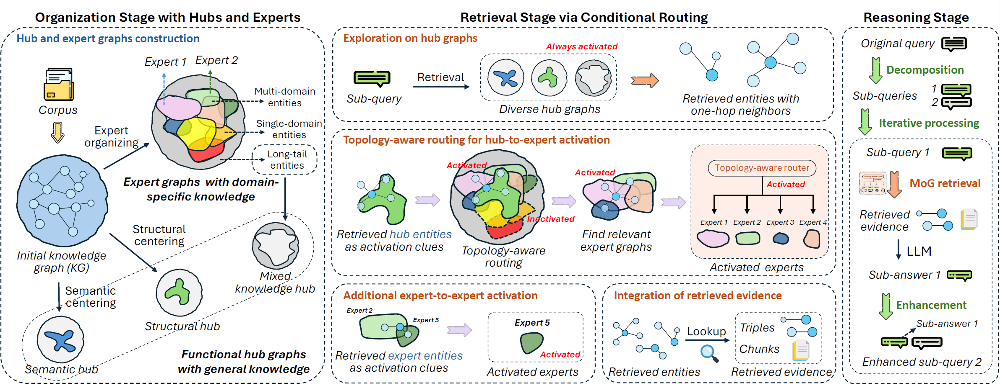

# MoG: Mixture of Experts for Graph-Augmented Complex Reasoning

This is the official codebase for **MoG**. It organizes knowledge into **always-on hub graphs** and **sparsely activated expert graphs**, and uses a **topology-aware router** to confine retrieval to a focused evidence subspace — achieving state-of-the-art performance on multi-hop complex reasoning with LLMs.

<p align="center">
  
</p>

## Highlights

- **Hub + Expert dual view of a KG.** Hubs capture broadly useful, structurally central knowledge; experts capture domain-specific, semantically coherent subsets — entities can belong to multiple hubs/experts.
- **Topology-aware router.** No extra training: the router uses retrieved entities, their KG neighbors, and expert membership to top-*k* activate experts per (sub-)query.
- **SOTA on multi-hop QA with LLMs.** On the most challenging MuSiQue, MoG yields **>20% relative improvement** over the strongest GraphRAG baselines.

## Repository Layout

```
mog/
├── main.py                     # Entry: KG preprocess / MoG build / retrieval
├── run.sh                      # Reference commands for demo / 2wiki / hotpot / musique
├── config/mog_config.yaml      # All hyper-parameters and dataset paths
├── llm.env                     # LLM_MODEL / LLM_BASE_URL / LLM_API_KEY
├── models/
│   ├── constructor/            # KG extraction, hub & expert graph construction
│   ├── retriever/              # Topology-aware router + retrieval
│   └── utils/
├── schemas/                    # Per-dataset schemas
└── content/                    # Figures and paper
```

## Setup

```bash
conda create -n mog python=3.10 -y
conda activate mog
pip install -r requirements.txt
python -m spacy download en_core_web_lg
```

Configure your LLM in `llm.env`. We use deepseek-v3-0324 by default:

```ini
LLM_MODEL=deepseek-chat          # deepseek-v3-0324
LLM_BASE_URL=https://api.deepseek.com/v1
LLM_API_KEY=sk-xxx
```

You can also use OpenAI models, e.g. GPT-4o-mini:

```ini
LLM_MODEL=gpt-4o-mini
LLM_BASE_URL=https://api.openai.com/v1
LLM_API_KEY=sk-xxx
```

## Datasets & Pre-built Artifacts

We release everything you need on Hugging Face:

| Folder | Content | Link |
|---|---|---|
| `datasets/` | Raw corpora & QA splits for `demo / hotpot / 2wiki / musique` | [HF datasets/](https://huggingface.co/datasets/noel7Y/mog-graphrag/tree/main/datasets) |
| `output/`   | Pre-extracted KGs, hub/expert graphs, FAISS indices | [HF output/](https://huggingface.co/datasets/noel7Y/mog-graphrag/tree/main/output) |

One-line download (places `datasets/` and `output/` at the repo root, matching `config/mog_config.yaml`):

```bash
huggingface-cli download noel7Y/mog-graphrag \
  --repo-type dataset --local-dir . --local-dir-use-symlinks False
```

> With `output/` downloaded you can **skip construction** and jump straight to retrieval and QA to reproduce the answers.

## Quick Start

The pipeline has three stages. Below uses the small `demo` dataset; replace with `hotpot / 2wiki / musique` for the full benchmarks (see `run.sh`).

```bash
# 1) Extract a base KG from the corpus
python main.py --config config/mog_config.yaml \
  --override '{"triggers": {"constructor_trigger": true, "retrieve_trigger": false}}' \
  --datasets demo --construction_mode KGPreprocess

# 2) Build hub graphs + cluster experts on top of the KG
python main.py --config config/mog_config.yaml \
  --override '{"triggers": {"constructor_trigger": true, "retrieve_trigger": false}}' \
  --datasets demo --construction_mode MoGBuild

# 3) Retrieve & answer (vanilla MoG)
python main.py --config config/mog_config.yaml \
  --override '{"triggers": {"constructor_trigger": false, "retrieve_trigger": true}}' \
  --datasets demo --construction_mode MoGBuild --retrieval_mode MoGRetrieval

# 3') Or with iterative reflection CoT
python main.py --config config/mog_config.yaml \
  --override '{"triggers": {"constructor_trigger": false, "retrieve_trigger": true}}' \
  --datasets demo --construction_mode MoGBuild --retrieval_mode MoGRetrieval_irCoT-5
```

If you downloaded the HF `output/` folder, **only step 3 (or 3') is needed**.

## Main Results (DeepSeek-V3)

Multi-hop QA accuracy (LLM-Acc / Match-Acc); best in **bold**, runner-up <ins>underlined</ins>.

| Method | HotpotQA | 2Wiki | MuSiQue |
|---|---|---|---|
| HippoRAG2          | 81.8 / 70.2 | 77.3 / <ins>82.5</ins> | 50.8 / 38.3 |
| Youtu-GraphRAG     | 83.7 / 71.6 | 72.8 / 77.6 | 51.4 / 40.5 |
| Youtu-GraphRAG-IRCoT | <ins>86.5</ins> / <ins>72.8</ins> | <ins>85.5</ins> / 78.9 | <ins>53.6</ins> / <ins>42.0</ins> |
| **MoG (ours)**         | 86.7 / 73.6 | 85.7 / 83.2 | **66.0** / **54.1** |
| **MoG-IRCoT (ours)**   | **87.8** / **77.4** | **88.4** / **88.1** | **67.2** / **54.1** |

→ Up to **+25.4%** relative LLM-Acc and **+28.8%** relative Match-Acc on MuSiQue. See the paper for full tables (incl. GPT-4o-mini, ablations and efficiency analysis).

## Citation

```bibtex
@article{mog2026,
  title   = {MoG: Mixture of Experts for Graph-Augmented Complex Reasoning},
  author  = {Anonymous},
  year    = {2026},
  note    = {Preprint}
}
```

## Acknowledgements

We build on the GraphRAG line of work, particularly [Youtu-GraphRAG](https://github.com/TencentCloudADP/youtu-graphrag) and [HippoRAG2](https://github.com/osu-nlp-group/hipporag). Thanks to the open-source community.

## License

Released under the [MIT License](LICENSE).
